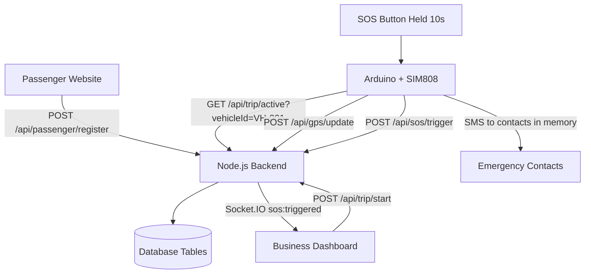

# Architecture

## Runtime Flow

1. Passenger registers with name, seat, emergency contacts, and vehicle ID.
2. Backend stores passenger and contact records.
3. Operator sees boarded passengers and starts a trip for a vehicle.
4. Arduino polls the active trip endpoint every 30 seconds and stores contacts in memory.
5. Arduino continuously posts GPS coordinates.
6. Holding the SOS button for 10 seconds sends SMS messages through SIM808 and posts an SOS event to the backend.
7. Backend broadcasts the SOS event to the dashboard over Socket.IO.

## API Endpoints

| Method | Endpoint | Purpose |
| --- | --- | --- |
| POST | `/api/passenger/register` | Save passenger and emergency contacts. |
| POST | `/api/trip/start` | Start an active vehicle trip from the dashboard. |
| GET | `/api/trip/active?vehicleId=VH-001` | Return the active trip and contacts for Arduino polling. |
| POST | `/api/gps/update` | Store Arduino GPS coordinates. |
| POST | `/api/sos/trigger` | Store and broadcast an SOS event. |

## Data Model

The scaffold currently uses in-memory arrays named after the planned tables:

- `passengers`: `name`, `seat`, `vehicleId`, `tripId`
- `contacts`: `phoneNumber`, `passengerId`
- `trips`: `vehicleId`, `status`, `startTime`
- `gps_logs`: `vehicleId`, `lat`, `lng`, `timestamp`
- `sos_alerts`: `tripId`, `triggeredAt`, `coordinates`
